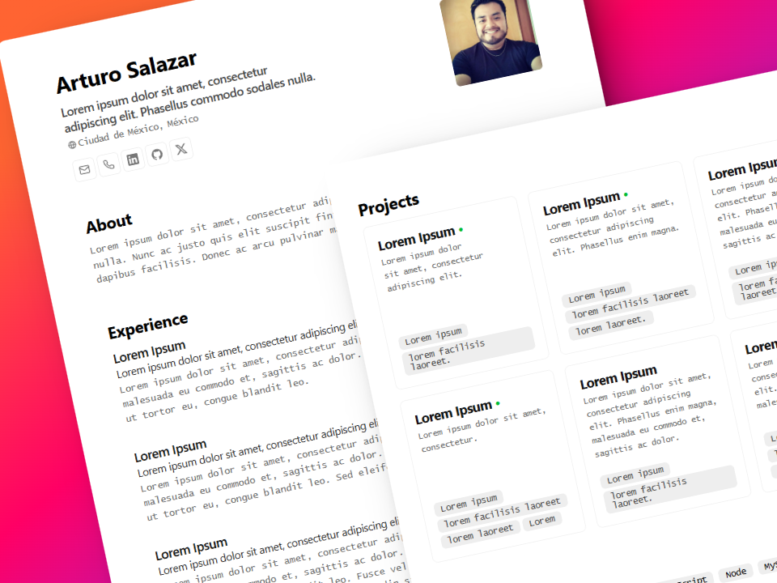
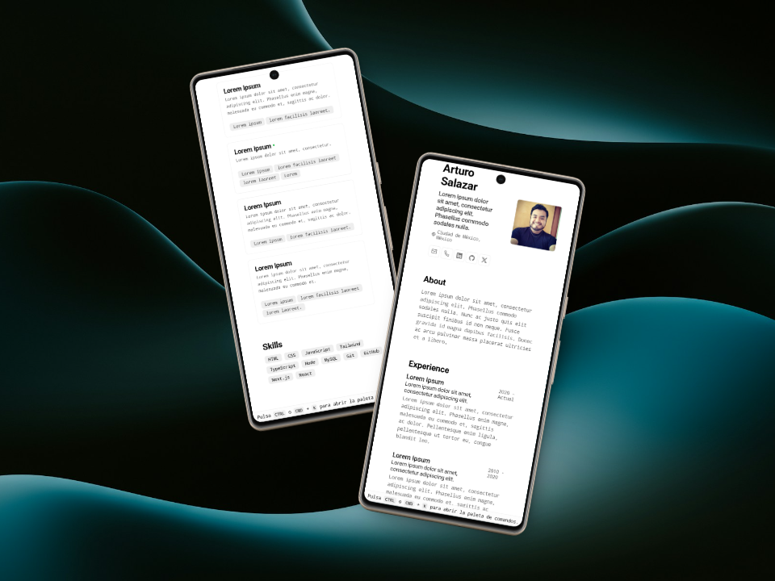

# 🚀 Astro Minimalist CV Template JSON

Un template de CV minimalista basado en Astro y estructurado con JSON. 

## ⚡ Tecnologías Usadas

## 📌 Características  
- ✅ Diseño limpio y minimalista.  
- ✅ JSON como fuente de datos.  
- ✅ Rápido y fácil de personalizar.

📄 **Crea tu CV en segundos** con este template en Astro + JSON.

Schema del JSON de CV:
https://jsonresume.org/schema/

Basado en el diseño de:
https://github.com/BartoszJarocki/cv

Alerta de combinación de teclas para impresión
https://github.com/ssleptsov/ninja-keys

🔹 **Edita `/cv.json` para personalizar tu información.**
🔹 **Exporta en PDF** con `Ctrl + P` desde el navegador.